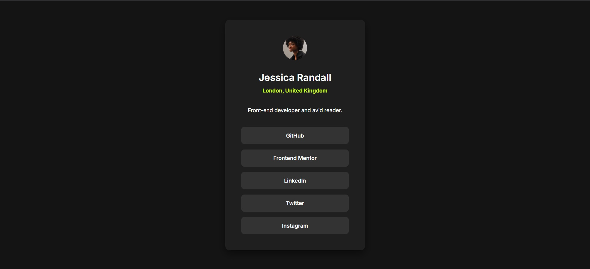

# Frontend Mentor - Social links profile solution

This is a solution to the [Social links profile challenge on Frontend Mentor](https://www.frontendmentor.io/challenges/social-links-profile-UG32l9m6dG). 

## 📷 Screenshot

## 🔗 Live Site

[View live site here](https://hemang1404.github.io/social-links-profile-main/)

---

## 🚀 My process

### Built with

- Semantic HTML5 markup
- CSS custom properties (variables)
- Flexbox
- Responsive design using `clamp` and viewport units
- Mobile-first workflow

---

## 💡 What I learned

- How to properly use `<a>` tags for navigation instead of nesting them inside `<button>`.
- Improved accessibility with `rel="noopener noreferrer"` and semantic heading structure.
- Using `clamp` for responsive widths and sizes.
- Creating hover effects with smooth transitions and color contrast.

---

## ✍️ Author

- Frontend Mentor profile: [@hemang1404](https://www.frontendmentor.io/profile/hemang1404)
- GitHub: [@hemang1404](https://github.com/hemang1404)

---

## 🎯 Acknowledgments

Thanks to the Frontend Mentor community for the feedback and design assets!

